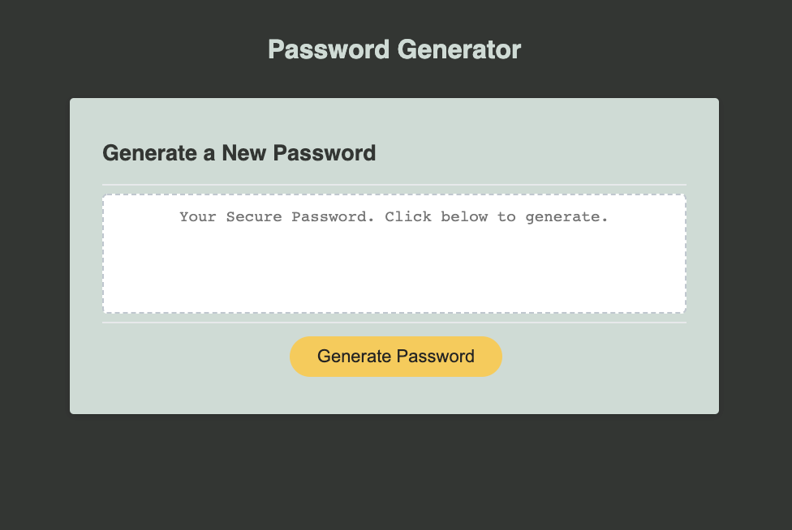
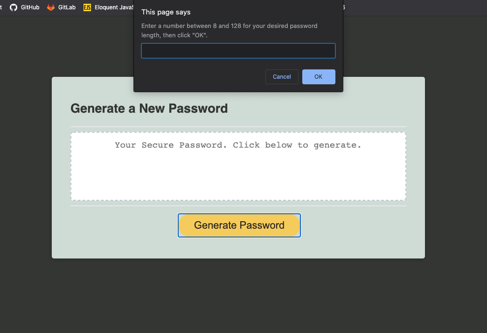
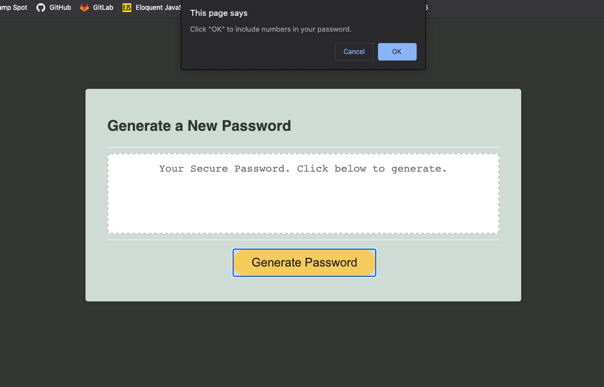
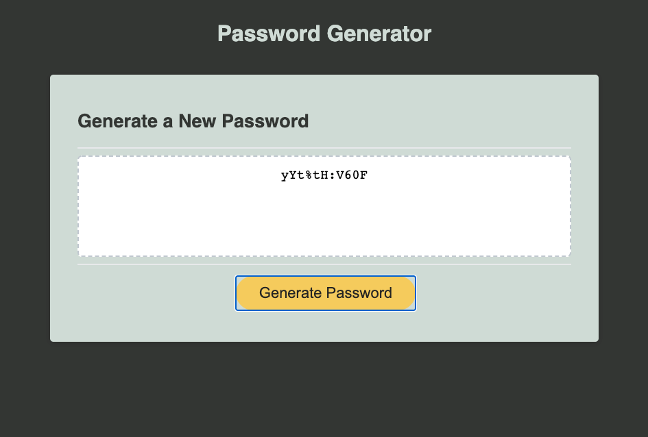

# Password Generator
https://scott-gr.github.io/gt-password-generator/

## Description
This application creates a secure, random password based on the user's criteria. The user can choose password length (between 8 and 128 characters) and what characters to include (uppercase letters, lowercase letters, numbers, and special characters). The app functions well in both desktop and mobile browsers.

## Contents
 * Assets folder
  - style.css
  - screenshots folder
 * index.html
 * script.js
 * README.md

## Installation
 1. Clone the github repo: 
 2. Open index.html in your browser.

## Usage
 * Navigate to the deployed app (https://scott-gr.github.io/gt-password-generator/) or install from repo.

 - Click 'Generate Password' button to begin.
 - Follow prompts to confirm your desired password criteria.
 - When all prompts are confirmed, a randomly generated password will appear in the center box. Write down or copy the password.
 - You may click 'Generate Password' again to create another password. There is no limit, but previous passwords will not be stored.

## Credits
Thank you to GT Coding Bootcamp for html and css files. Thank you to bootcamp classmates for links to javascript resources and discussion of logic outline notes for application. Color scheme from coolers.co (https://coolors.co/cfdbd5-e8eddf-f5cb5c-242423-333533)

## Collaborators
I, Scott Griffin was the sole collaborator on this project.

## License
[MIT](https://choosealicense.com/licenses/mit/)